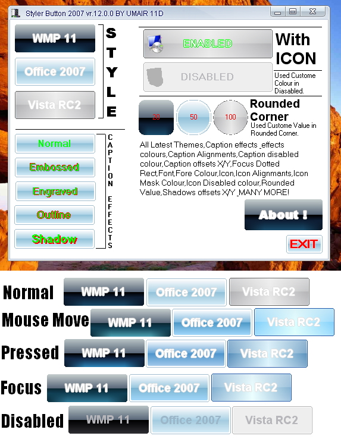



## Updated Styler Button 2007

### Description

This is my first project.Styler Button 2007 is Very Quick, Powerful &amp; New styles Botton.Styler Button 2007 enables you to customize the appearance of your applications to suit your individual needs.

I am PAKISTANI.MY LANGUAGE IS URDU.Sorry my bad English.

for more informtion About form.
 
### More Info
 

             |
---                |---
**Submitted On**   |2007-01-10 16:13:50
**By**             |[Muhammad Umair 11D](https://github.com/Planet-Source-Code/PSCIndex/blob/master/ByAuthor/muhammad-umair-11d.md)
**Level**          |Intermediate
**User Rating**    |5.0 (50 globes from 10 users)
**Compatibility**  |VB 6\.0
**Category**       |[Custom Controls/ Forms/  Menus](https://github.com/Planet-Source-Code/PSCIndex/blob/master/ByCategory/custom-controls-forms-menus__1-4.md)
**World**          |[Visual Basic](https://github.com/Planet-Source-Code/PSCIndex/blob/master/ByWorld/visual-basic.md)
**Archive File**   |[Updated\_St2042581152007\.zip](https://github.com/Planet-Source-Code/muhammad-umair-11d-updated-styler-button-2007__1-67598/archive/master.zip)

